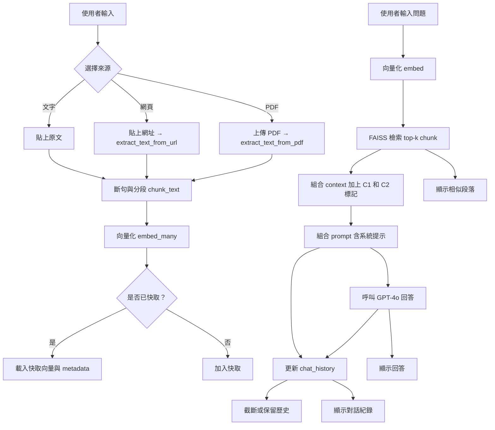

```mermaid

flowchart TD

%% === 使用者輸入 ===
A1[使用者輸入]
A1 --> B1{選擇來源}
B1 -->|PDF| C1[上傳 PDF → extract_text_from_pdf]
B1 -->|網頁| C2[貼上網址 → extract_text_from_url]
B1 -->|文字| C3[貼上原文]

%% === 預處理 ===
C1 --> D1[斷句與分段 chunk_text]
C2 --> D1
C3 --> D1
D1 --> D2[向量化 embed_many]

%% === 快取 ===
D2 --> E1{是否已快取？}
E1 -->|是| E2[載入快取向量與 metadata]
E1 -->|否| E3[加入快取]

%% === 問題處理 ===
A2[使用者輸入問題] --> F1[向量化 embed]

%% === 向量搜尋與 RAG ===
F1 --> G1[FAISS 檢索 top-k chunk]
G1 --> G2[組合 context 加上 C1 和 C2 標記]
G2 --> G3[組合 prompt 含系統提示]
G3 --> G4[呼叫 GPT-4o 回答]

%% === 對話歷史 ===
G4 --> H1[更新 chat_history]
G3 --> H1
H1 --> I1[截斷或保留歷史]

%% === 顯示回應 ===
G4 --> J1[顯示回答]
G1 --> J2[顯示相似段落]
H1 --> J3[顯示對話紀錄]
```

